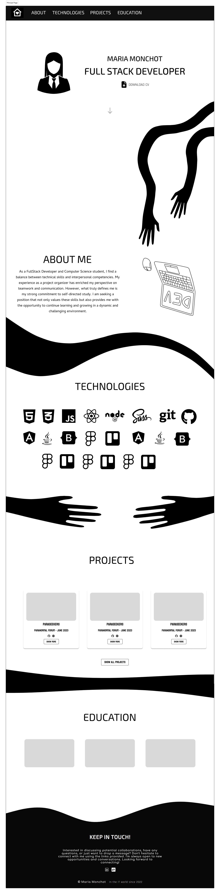
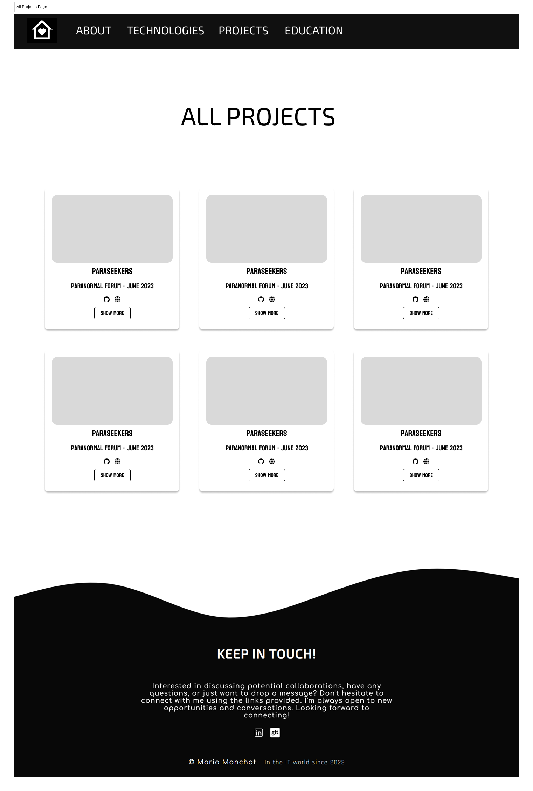
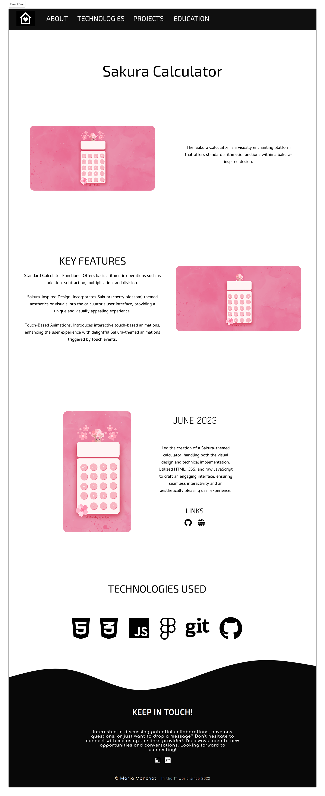

# 🌐 Portfolio 2023 – Maria Monchot

Este es mi portfolio personal desarrollado en 2023, diseñado desde cero en **Figma** y codificado completamente en **Vite + React + TypeScript**.  
El objetivo fue crear un espacio moderno, simple y visual donde centralizar mis proyectos y mi experiencia.  

---

<table>
  <tr>
    <td align="center" valign="top" width="33%">
      
🖥️ Principal Page

      
    </td>
    <td align="center" valign="top" width="33%">
      
🖥️ All Projects

      
    </td>
    <td align="center" valign="top" width="33%">
      
🖥️ Project

      
    </td>
  </tr>
</table>

> ✨ Diseño **responsive**, adaptado tanto a dispositivos móviles como de escritorio.

---

## ⚙️ Tecnologías utilizadas

- **React + Vite**
- **TypeScript**
- **Sass (SCSS)**
- **Framer Motion** (animaciones)
- **Figma** (diseño original)

---
